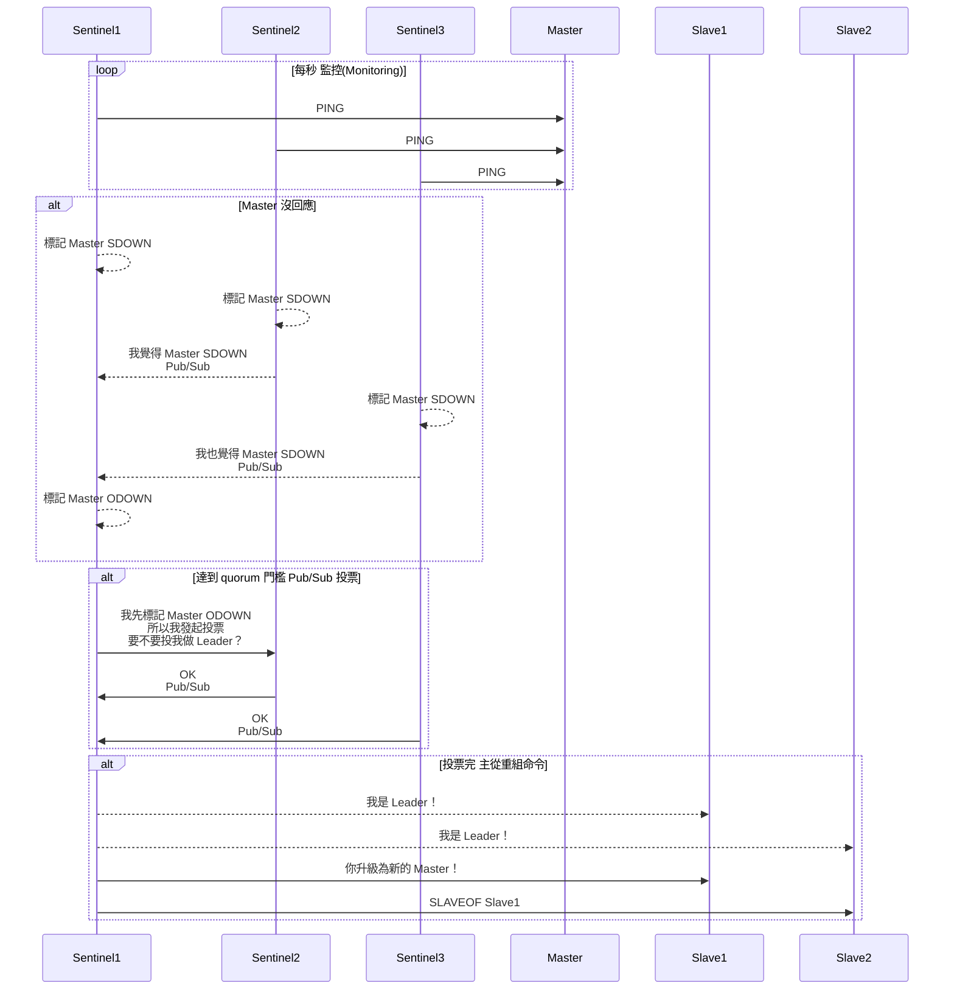
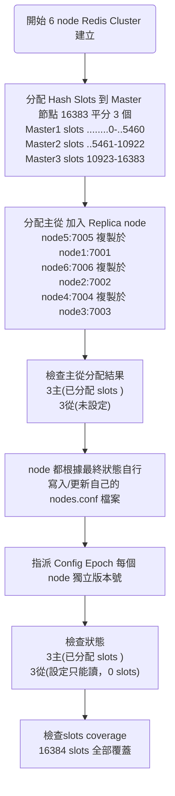
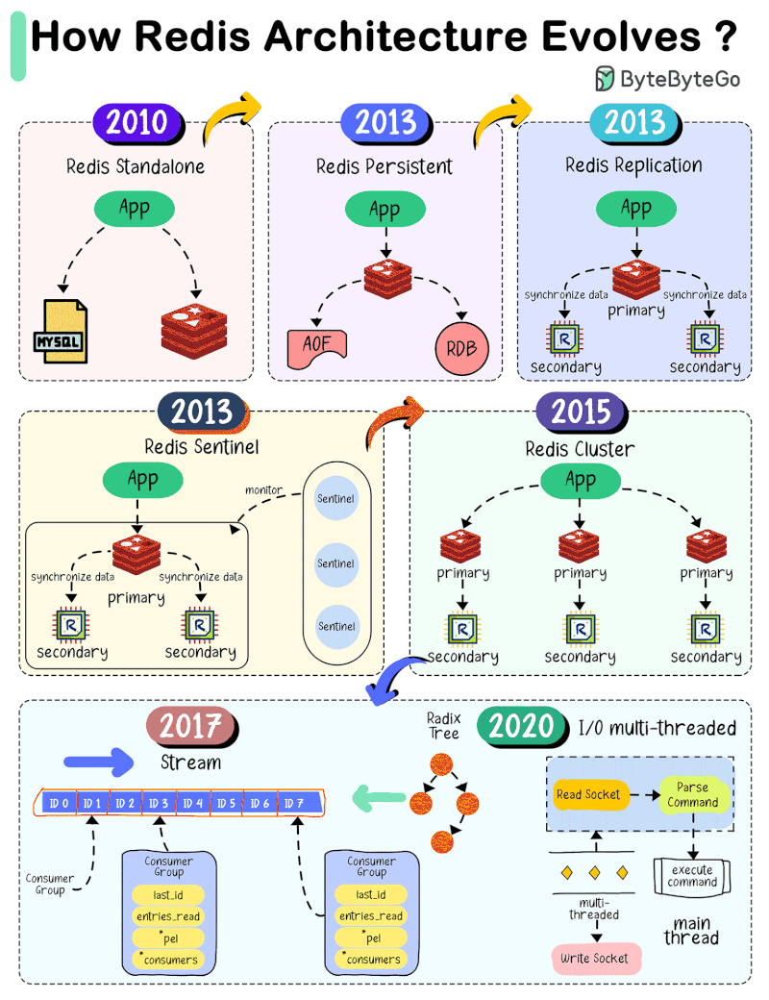

# Redis 架構說明

## 應用架構衍生背景

### Redis 單機瓶頸 

為了達到快速讀寫，開發者會將大量查詢頻繁的資料快取到 Redis， Session、熱門商品資訊、排行榜、通知、推播資料等。

隨著系統規模成長，開發者往往會把越來越多資料塞進 Redis，希望通通快取、全面加速。

---

.png)

---

1. 不具備資料持久性（Durability）

   [^A不具備資料持久性]: Redis 是以 RAM 為主要儲存媒介，天生為 volatile 設計，一旦機器異常重啟、當機或斷電，快取中的資料將立即遺失。雖然 Redis 提供 RDB（定時快照）與 AOF（操作記錄）機制以支援持久化，快照（RDB）存在備份週期落差，非實時，AOF 在高併發下可能影響效能與寫入延遲

   若在高流量交易環境中啟用持久化，反而削弱 Redis 作為快取層的高效能特性，造成系統效能瓶頸。因此，單機 Redis 無法被視為具備資料持久性的可靠儲存方案。

2. 單機 IO 壓力集中（I/O Bottleneck）

   [^B 單機 IO 壓力集中 ]: 在高併發微服務架構中，若多個應用服務共用同一個 Redis 節點，而 Redis 快取容量或效能未隨之擴張，將導致所有讀寫操作集中在單一執行緒上，形成 I/O 壓力瓶頸 

---

3. 不具備 HA (High Availability 高可用性）

   [^C不具備HA ]: 若單點故障，及服務中斷，沒有辦法自動切換到備援節點來提供不中斷服務 Auto Failover

4. 無法橫向擴展( Scalability )

   [^D無法橫向擴展]: Redis 為記憶體資料庫，機器 RAM 就是儲存上限，Redis 是單執行緒，CPU 核心吃滿後就無法再提升效能。想升級只能垂直擴充（加 RAM、CPU）。

## Redis 架構說明

參考：https://hackmd.io/@tienyulin/redis-master-slave-replication-sentinel-cluster

### 主從複製 

Master-Slave Replication 一主多從，解決 [^A不具備資料持久性] ，從 server 做到簡單備援。

主 server 單點寫入，從 server 讀取，做到讀寫分離，解決 [^B 單機 IO 壓力集中 ]。

### 哨兵模式 

Sentinel 主從複製的基礎上，解決 [^A不具備資料持久性] 、 [^B 單機 IO 壓力集中 ]。

搭配 Sentinel「只做監控、不儲存資料」的執行緒，透過投票 vote quorum 主從切換，使服務自動切換備援，解決[^C不具備HA ]。

#### SDOWN/ODOWN

主觀下線

Subjectively Down， 當 sentinel1 監控到 master 下線，sentinel1  會標記 master SDOWN

客觀下線

Objectively Down，若 sentinel1、sentinel2 都標記 master SDOWN， master 被視為 Objectively Down。

#### epoch

是一個 64 bit unsigned int，初始化 Master / Slave 都是 0，在發送訊息時加 1，在收到訊息時如果對方的 epoch 高於自己，則更新 epoch 並加 1；
遇到有衝突，則選擇 epoch 較高的那一則訊息，Master 在發送 ping 時會夾帶 configEpoch 且在回 pong 時會夾帶所屬的 slot mapping

### vote quorum

最終一致性投票邏輯



### 叢集模式

Cluster 多主多從，解決 [^A不具備資料持久性] 、 [^B 單機 IO 壓力集中 ]。

節點之間會自行運作 Gossip 協議，使服務自動切換備援，解決[^C不具備HA ]。

資料分片 (Sharding) 的技術，自動地將資料拆分到多台的伺服器上，以水平的擴充記憶體的容量，解決 [^D無法橫向擴展]。

#### 叢集建立流程




#### 資料分片 (Sharding) 

把整個 key space 拆成 16384 個 slot( HASH_SLOT )，自動分配到多個 master 節點

當資料變多、流量變大，新增節點以分攤壓力

#### Gossip 協議

Gossip protocol 讓節點彼此交換狀態資訊，實作分散式健康檢查與節點發現。

每個節點定期隨機挑幾個節點溝通，檢查其他節點是否存活

傳遞哪些節點掛了（FAIL）或恢復（OK）

節點間彼此同步彼此看到的狀態，分散式傳播某個節點的失效資訊（去中心化），不依賴單一 Master、Sentinel 

bus-port 預設是 server 1+port，若 server 6379 那溝通的 bus-port 就是 16379 

#### ASK 轉向 / MOVED 轉向機制（請求重新導向）

當你對 Redis Cluster 發送請求，但該 key 所屬的 **hash slot 不在目前連線的節點上**，Redis 會回傳 MOVED 錯誤，告訴 client「去正確的節點處理這個 key」。

ASK 發生在slot 遷移（resharding）過程中，當 key 的 slot 尚未完成主權轉移，Redis 會暫時允許對新主節點請求，但要求先發送 ASKING 指令。

#### Fail Over

每個 master 配一個或多個 slave，當 master 掛掉，會隨機選一個 slave 自動接管（Fail-Over）

假設 node1:7001 Faill 

在 node 1 Faill 時，剩餘存活的 master node2、node3 會 gossip 溝通，並更新 node.conf 隨機選一個 slave 變成 master


```powershell
redis-cli -h 192.168.1.91 -p 7002 cluster nodes
```

自動接管之後，主從會從新隨機分配
master  node2 slave node4
master  node3 slave node5
master  node6 就沒有 slave 了


### 架構比較

| 項目          | Redis Master-Slave                      | Redis Sentinel                                               | Redis Cluster                                 |
| ------------- | --------------------------------------- | ------------------------------------------------------------ | --------------------------------------------- |
| 架構          | 1 * Master<br />n * Slaves              | m * Sentinels m > 3, odd<br />1 * Master<br />n * Slaves     | m * Masters m > 3, odd<br />m * n * Slaves    |
| 核心機制      | 手動設定主從<br />Slave 被動接收 Master | vote quorum<br />Sentinel ping/pong Master                   | Gossip 協議<br />全員 ping/pong               |
| 資料一致性    | NA                                      | 最終一致性(弱AP)                                             | 最終一致性 (AP)                               |
| 水平擴展      | 不支援                                  | 不支援                                                       | ✅ Slot 分片橫向擴展                           |
| 寫入限制      | 寫 Master 讀 Slave                      | 經 Sentinels 查 寫 Master 讀 Slave                           | 經slot 寫 Master 讀 Slave                     |
| 自動 Failover | NA                                      | ✅自動 failover                                               | ✅自動 failover                                |
| 主從關係      | 一主多從                                | 一主多從                                                     | 多主多從分片組                                |
| 適用場景      | 備援                                    | 備援+夠用的 failover                                         | 可擴充巨量資料（百 GB ～ TB）<br />高容量負載 |
| 場景例子      |                                         | 中小型 B2C / SaaS 服務平台<br />遊戲伺服器後台<br />微服務架構中的 session 存儲/簡易 KV | 大型電商網站商品快取<br />名人的 tweet        |

1. Redis 讀取

   單點讀取(只讀一台 redis) + 回源模式( 回 db Read-through )

   設計上不論 Redis 有幾台，client  都只會挑一台讀取，若是 cache miss 走 Read-through，不會 retry 其他 redis

2. Redis Raft 架構

   Raft 最少需要 3 個節點（1 Leader+ 2 Followers）才能容忍 1 個 failover（即保證 quorum 過半投票）

   1+n > 3, odd, 奇數以避免選 Leader tie

3. Redis Cluster 架構

   m * Masters m > 3, odd 最少 3 個 Masters 節點形成 cluster，奇數以避免選 Masters tie

   m * n * Slaves，每個 Master 至少配置一個 Slave 容忍 1 個 failover

4. Redis Sentinel 架構

   至少 3 個 sentinel 才能投票出結果

5. Redis Sentinel 核心機制

   全員 Sentinel ping/pong 一個 Master 檢查存活

   Pub/Sub 則是讓 Sentinel 間需要知道彼此存在 + 狀態資訊

6. Redis Sentinel 弱AP: 

   雖然在形式上具備分區容忍（P）與可用性（A），但實際上可用性不穩定（弱 A）。
   切換 Master 需透過 Sentinel 投票，過程可能花費數秒，client 在此期間連線舊 Master 可能出現寫入失敗或 timeout。
   切換後若未強制關閉原 Master，則可能產生 split-brain，導致 client 寫入結果不確定（有時成功、有時 timeout、有時寫錯資料）。

7. Redis Sentinel 讀取

   client 透過 Sentinel 查詢 Slave 清單，由 client 決定讀哪台 Slave 。

8. Redis Cluster 讀取

   client  透過 slot 對應與 redirection 找到對應節點

   若啟用 `readonly` 模式，client 可自動讀該 slot 的 Slave 節點。

## Redis 架構實作

### 主從複製實作

Redis image 必須沒有 module

在容器環境中，Redis 不會掛載實體磁碟，因此同步過程必須依賴 `repl-diskless-sync` 以即時記憶體傳輸方式進行主從複製，避免寫入本地磁碟造成失敗。
若使用了 Redis module，同步時的 .rdb 中將包含模組的內部資料結構，slave 若未載入相同模組，將無法正確反序列化資料，導致複製失敗，會造成 .rdb 成功傳輸給 Slave，但 Slave 載入記憶體階段出錯，而不停重試同步 。
因此，image 必須使用無任何外掛 module 的純淨 Redis 映像檔，範例測試 `redis:6.2.19`，以確保複製過程的相容性與穩定性。

```powershell
#檢查 pull 的 redis image 有沒有 Module，必須是 (empty array)
redis-cli MODULE LIST
```

### 哨兵模式實作

#### 實作重點1

master 的連線與 sentinel 要分別實作

```c#
#取得 sentinel
var sentinelMux = ConnectionMultiplexer.Connect(sentinelConfig);
#透過 sentinel 取得 queryMaster 並不是真的 master
var queryMaster = sentinelMux.GetSentinelMasterConnection(redisServiceConfig);

 #這才是真的 master
 MasterEndpoint = queryMaster.GetEndPoints()
                    .Select(ep => queryMaster.GetServer(ep))
                    .FirstOrDefault(s => !s.IsReplica)?.EndPoint.ToString() ?? "";
 #這才是真的 slaves
 var slaves = queryMaster.GetEndPoints()
         .Select(ep => queryMaster.GetServer(ep))
         .Where(s => s.IsReplica)
         .Select(s => s.EndPoint.ToString());
```

#### 實作重點2

Lib 實體要 AddScoped

AddScoped才可以在每一次請求都 renew redis connection，讓 failover 可以順利讀取，銜接接管新的 redis connection。

#### 實作要點3

sentinel 與所有 nodes 的系統時間要一致

指令檢查是否一致，若不一致，會觸發 tilt mode exited

Redis Sentinel 的 tilt mode 是為了保護叢集，在系統時間出現「快跳 / 慢跳」的狀況時（如 NTP 同步時），它會暫停：1主節點故障偵測、2選主投票、3自動切換功能，一段時間內不進行判斷。

如果你的各個 sentinel/slave/master 時間落差太大，failover 判斷會錯誤，造成叢集不一致或「永遠在 wait」。

```powershell
# 檢查容器時間
"sentinel-master","sentinel-slave1","sentinel-slave2","sentinel1","sentinel2","sentinel3" | ForEach-Object { $_ + ": " + (docker exec $_ date) }
```

### 叢集模式實作

#### 實作重點1

Cluster Redis 必須是乾淨的

每一個 redis node 必須沒有任何資料，故 docker compose 重啟時，除了 container 要全部刪掉、Volumes 也要全部刪除

沒有刪除乾淨，就會在redis-cluster creator 看到這個錯誤

2025-07-15 17:37:29 [ERR] Node 192.168.1.91:7001 is not empty. Either the node already knows other nodes (check with CLUSTER NODES) or contains some key in database 0.

#### 實作重點2

UI 可看到 Master 所有資料，但只有 Slot Owner 可以編輯自己的資料

範例 Update Cache  "xxxxxxx" node 1、node 2 node 3 

#### 實作重點3

Lib 實體要 AddScoped

AddScoped才可以在每一次請求都 renew redis connection，讓 failover 可以順利讀取，銜接接管新的 redis connection。


## 補充

### 架構演進



來源: https://tech.lucumt.info/docs/db/redis/redis-architecture-evolve/

| 版本          | 發布時間 | 重大更新                                                     | 說明                                                         |
| ------------- | -------- | ------------------------------------------------------------ | ------------------------------------------------------------ |
| **Redis 5.0** | 2017     | • stream data type<br />• ZPOP/BPOP 新指令                   | 新增 Kafka 式訊息串流支援，改善內存碎片問題，強化排序集 pop API |
| **Redis 6.0** | 2020     | • ACL（使用者層級權限）<br />• TLS 加密支援<br />• I/O 多執行緒 | 把接收資料這一段變成多執行緒，讓它更快；但資料處理本身仍維持單執行緒。 |
| **Redis 7.0** | 2022     | • ACL v2（選擇性權限控制）<br />• Sharded Pub/Sub            | 資安升級、多執行緒優化                                       |
| **Redis 8.0** | 2025     | • 整合模組：JSON、TimeSeries 等<br />• 效能提升：命令快 +87%、倍增吞吐量、複製快 +18%<br />• 記憶體最佳化＋licensing 改為 AGPL | 全模組化列入核心，支持 AI use case，整體效能與記憶體使用大幅改善 |

### Redis 其他架構

- **Twemproxy**：Twitter 開源 Redis 分片代理，部署簡單，但不支援多 key、pipeline、Pub/Sub。適合靜態分片。
- **Codis**：支援 slot 遷移、Web 管理介面，比 Twemproxy 功能完整。適合中型分片場景。
- **Redis on Kubernetes**：以 StatefulSet + PVC 部署 Redis，可搭配 Sentinel/Cluster/Operator 實現高可用與自動化。
- **Redis Cloud / ElastiCache**：雲端託管 Redis，支援備援、自動 failover 與擴展。適合不想自行維運的團隊。

### CAP 理論

參考: https://kefeng.wang/2018/08/01/distributed-cap/

分散式系統設計的基礎原則指出：CAP 三者無法兼得。當網路分區發生（P 成立）時，系統無法同時滿足一致性（C）與可用性（A），因此在分散式架構中，必須在 C 與 A 之間擇一放棄。

Partition Tolerance (P): 分區容忍，即使部分節點間網路中斷，整個系統仍能繼續服務

Availability (A): 可用性，每個非故障的節點，都能及時回應請求（不會掛住、不回應）

Consistency (C): 一致性，所有節點對同一資料讀到的值是一致的（如同單機系統）

| 系統類型      | 分類 | 說明                                         |
| ------------- | ---- | -------------------------------------------- |
| Redis 單機    | CP   | 一致性為先，必要時拒絕寫入（放棄可用性）     |
| Redis Cluster | AP   | 分區時仍允許寫入，但不同節點資料可能不一致   |
| RDBMS         | CA   | 不容忍分區，集中處理寫入與查詢，傳統單體架構 |


