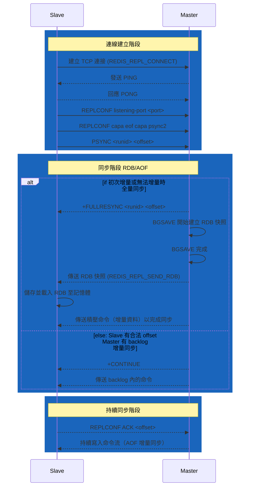
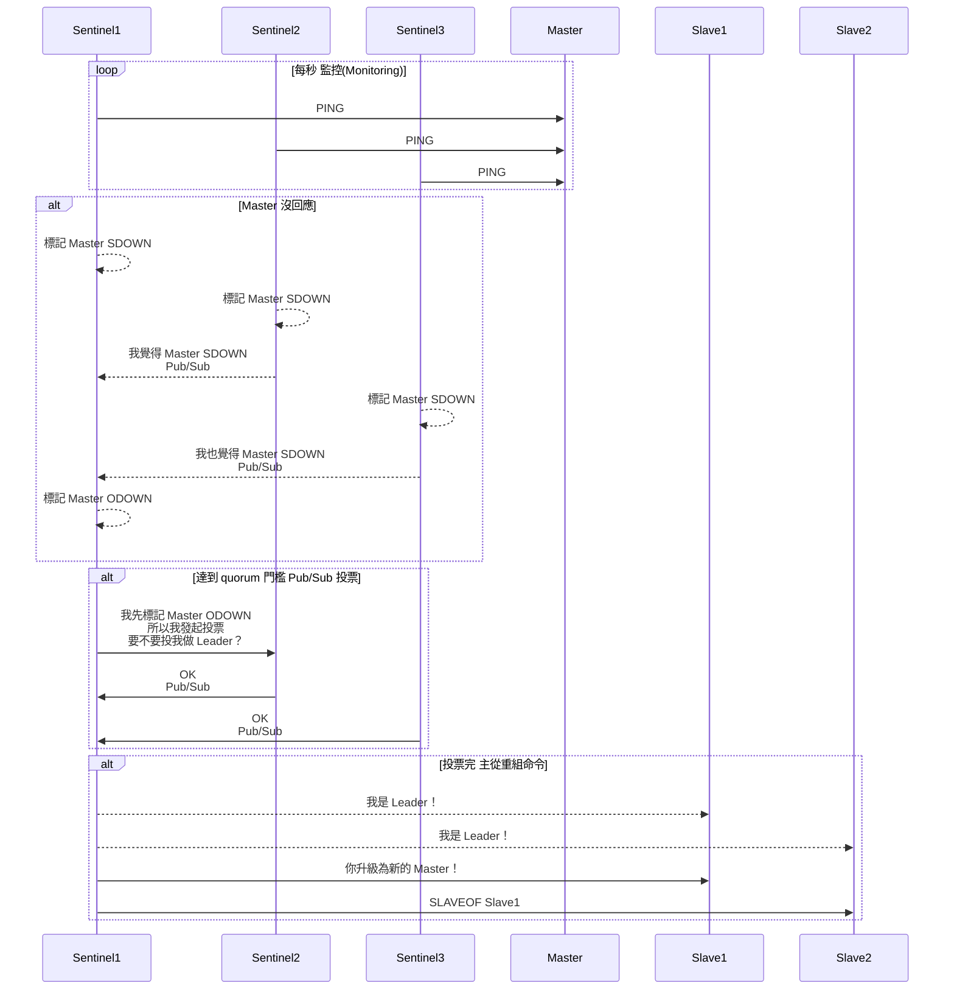
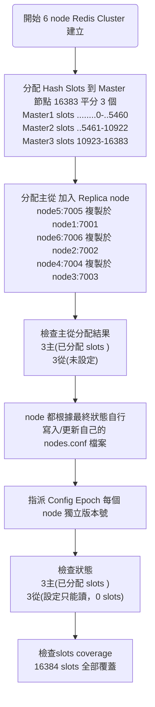
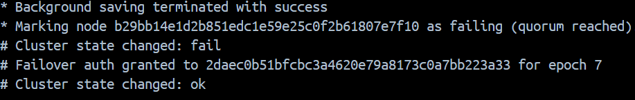
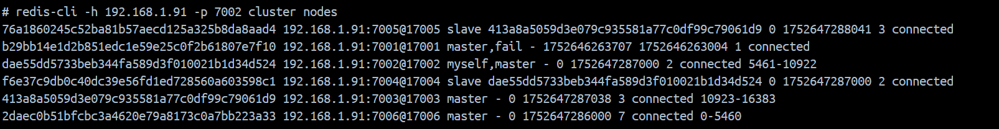
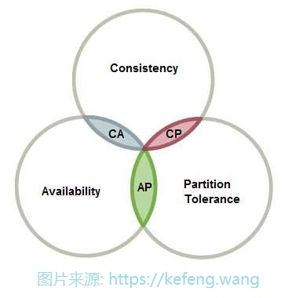

# Redis 架構說明

本專案為 Redis 高可用性架構的實作範例，透過 ASP.NET Core 9 Web API 與 Docker Compose 展示四種 Redis 部署模式：**主從複製（Master-Slave）**、**哨兵模式（Sentinel）**、**叢集模式（Cluster）** 與 **Raft 共識（RedisRaft）**。

## 專案特色

- **多架構實作**：涵蓋 Redis 從基礎備援到高可用性與水平擴展的完整演進
- **容器化部署**：所有架構皆使用 Docker Compose 一鍵啟動，便於學習與測試
- **實務導向**：包含連線管理、讀寫分離、自動故障轉移（Failover）等生產環境考量
- **完整文件**：詳細說明各架構原理、同步機制、CAP 特性與實作注意事項

## 技術棧

- **.NET 9** - ASP.NET Core Web API
- **StackExchange.Redis** - Redis client library
- **Docker & Docker Compose** - 容器化部署
- **Redis 6.2.19** - Redis server

## 專案結構

```
RedisLab/
├── AP/                          # ASP.NET Core Web API 專案
│   ├── Controllers/             # API 控制器（CacheController）
│   ├── Redis/                   # Redis 連線實作
│   │   ├── RedisConn/          # 各架構實作類別
│   │   │   ├── RedisMasterSlave.cs    # 主從複製
│   │   │   ├── RedisSentinel.cs       # 哨兵模式
│   │   │   ├── RedisCluster.cs        # 叢集模式
│   │   │   └── RedisRaft.cs           # Raft 共識
│   │   └── RedisDI.cs          # 依賴注入設定
│   └── appsettings.json        # 各架構連線設定
├── redis-master-slave/          # 主從複製 Docker Compose
├── redis-sentinel/              # 哨兵模式 Docker Compose
├── redis-cluster/               # 叢集模式 Docker Compose
└── redis-raft/                  # Raft 共識 Docker Compose
```

## API 端點

- `GET /Cache/GetCache?key={key}` - 讀取快取（從 Slave/Replica 讀取）
- `POST /Cache/UpdateCache` - 寫入快取（寫入 Master）
  ```json
  { "key": "testKey", "value": "testValue" }
  ```
- `GET /Cache/FillCluster` - 批次填充 Cluster 測試資料

作者：Amanda

日期：2025/07/23

## 應用架構衍生背景

### Redis 單機瓶頸 

為了達到快速讀寫，開發者會將大量查詢頻繁的資料快取到 Redis， Session、熱門商品資訊、排行榜、通知、推播資料等。

隨著系統規模成長，開發者往往會把越來越多資料塞進 Redis，希望通通快取、全面加速。

---

.png)

---

1. 不具備資料持久性（Durability）

   [^A不具備資料持久性]: Redis 是以 RAM 為主要儲存媒介，天生為 volatile 設計，一旦機器異常重啟、當機或斷電，快取中的資料將立即遺失。雖然 Redis 提供 RDB（定時快照）與 AOF（操作記錄）機制以支援持久化，快照（RDB）存在備份週期落差，非實時，AOF 在高併發下可能影響效能與寫入延遲

   若在高流量交易環境中啟用持久化，反而削弱 Redis 作為快取層的高效能特性，造成系統效能瓶頸。因此，單機 Redis 無法被視為具備資料持久性的可靠儲存方案。

2. 單機 IO 壓力集中（I/O Bottleneck）

   [^B 單機 IO 壓力集中 ]: 在高併發微服務架構中，若多個應用服務共用同一個 Redis 節點，而 Redis 快取容量或效能未隨之擴張，將導致所有讀寫操作集中在單一執行緒上，形成 I/O 壓力瓶頸 


3. 不具備 HA (High Availability 高可用性）

   [^C不具備HA ]: 若單點故障，及服務中斷，沒有辦法自動切換到備援節點來提供不中斷服務 Auto Failover

4. 無法橫向擴展( Scalability )

   [^D無法橫向擴展]: Redis 為記憶體資料庫，機器 RAM 就是儲存上限，Redis 是單執行緒，CPU 核心吃滿後就無法再提升效能。想升級只能垂直擴充（加 RAM、CPU）。

## Redis 架構說明

### 主從複製 

Master-Slave Replication 一主多從，解決 [^A不具備資料持久性] ，從 server 做到簡單備援。

主 server 單點寫入，從 server 讀取，做到讀寫分離，解決 [^B 單機 IO 壓力集中 ]。

#### 同步方式



參考: [Redis Replication 同步如何執行？](https://medium.com/jerrynotes/redis-replication-%E5%90%8C%E6%AD%A5%E5%A6%82%E4%BD%95%E5%9F%B7%E8%A1%8C-ef48675f6918)

##### 全量複製

FULLRESYNC <runid> <offset>

master 會建立一份 RDB 快照（或使用現有 RDB）。salve 載入 RDB 到記憶體。

複製方式只有 .rdb ，AOF 是讓 redis 自己重啟恢復用，無法用在複製上。

如果開啟了 AOF + RDB，對 master 自身重啟後狀態恢復更完整與快速。

##### 增量複製

PSYNC <runid> <offset>

master 比對 offset 後傳送這段期間的新資料（backlog buffer 裡的 command）salve 接收後補上，就恢復同步。

如果 salve 斷線時間太長，offset 落在 backlog 之外，就只能重新走 full sync。

#### 延遲雙寫（write lag）

若當機的時機點是 Master 停掉的時候，Redis 切到 slave 當新的 master，結果資料沒同步過來，導致資料遺失、不一致。

解決辦法是 Cache Aside（Lazy Loading），確保服務再寫  redis 之前，DB 一定有資料，Read though cache miss 還可以在 db 找到資料。

#### 複製風暴 (Replication storm)

參考: https://blog.csdn.net/weixin_43728884/article/details/130395777

因某些原因導致從節點斷線、重新連接時，主節點向多個從節點同時進行全量複製的情況( 不停產生與發送 .rdb檔案 )。這會導致主節點的 CPU 和網路頻寬資源被大量占用，可能導致主節點崩潰或無法回應其他客戶端請求。

要避免複製風暴，分批次的方式逐一重啟從節點，避免同時連接到主節點導致複製風暴，並在下複製指令之前檢查 salve 健康。

### 哨兵模式

Sentinel 主從複製的基礎上，解決 [^A不具備資料持久性] 、 [^B 單機 IO 壓力集中 ]。

搭配 Sentinel「只做監控、不儲存資料」的執行緒，透過投票 vote quorum 主從切換，使服務自動切換備援，解決[^C不具備HA ]。

#### SDOWN/ODOWN

主觀下線

Subjectively Down， 當 sentinel1 監控到 master 下線，sentinel1  會標記 master SDOWN

客觀下線

Objectively Down，若 sentinel1、sentinel2 都標記 master SDOWN， master 被視為 Objectively Down。

#### Pub/Sub

Publisher-Subscriber 模式，讓 Sentinel  來偵測主節點異常、廣播切換通知。

每個 Sentinel 會訂閱特定頻道（__sentinel__:hello）

Sentinel 定期透過該頻道廣播自己的狀態

當發生主從切換（Failover）時，Sentinel 也會透過 Pub/Sub 通知其他 Sentinel 與 client

#### epoch

是一個 64 bit unsigned int，初始化 Master / Slave 都是 0，在發送訊息時加 1，在收到訊息時如果對方的 epoch 高於自己，則更新 epoch 並加 1；
遇到有衝突，則選擇 epoch 較高的那一則訊息，Master 在發送 ping 時會夾帶 configEpoch 且在回 pong 時會夾帶所屬的 slot mapping

#### vote quorum

最終一致性投票邏輯



#### 複製風暴 (Replication storm)

參考: https://blog.csdn.net/weixin_43728884/article/details/130395777

Sentinel 是被動反應 + 自動切換，slave 的同步是 Redis 內部直接處理的

1. 原主節點 A 斷線，Sentinel 宣告 failover。
2. 某個從節點 B 被升級為新的主節點。
3. 原主節點 A 稍後「重新連上來」。
4. 這時 A 就會變成一個「舊主節點，但新的從節點」，自動轉為連線到 B。
5. 其他原來跟隨 A 的從節點 C、D、E，也會試圖連線到 B（新主節點）→ 同時觸發 full sync。

補強：

1. `repl-diskless-sync yes`：主節點一次性生成 RDB，記憶體傳送給所有新 slave ，不寫入磁碟
2. `repl-diskless-sync-delay <sec>` : 延遲 slave 同步，給 master 緩衝時間，但會犧牲可用性
3. 監控 + 批次重啟 slave : 使用工具或腳本分批啟動從節點，避免複製風暴。
4. 改用 Redis Cluster : Cluster 有更完整的 metadata 控制，所有 node 之間各自協調，不會有重複 master 的問題

### 叢集模式

Cluster 多主多從，解決 [^A不具備資料持久性] 、 [^B 單機 IO 壓力集中 ]。

節點之間會自行運作 Gossip 協議，使服務自動切換備援，解決[^C不具備HA ]。

資料分片 (Sharding) 的技術，自動地將資料拆分到多台的伺服器上，以水平的擴充記憶體的容量，解決 [^D無法橫向擴展]。

#### 叢集建立流程




#### 資料分片 (Sharding) 

把整個 key space 拆成 16384 個 slot( HASH_SLOT )，自動分配到多個 master 節點

當資料變多、流量變大，新增節點以分攤壓力

參考: https://hackmd.io/@tienyulin/redis-master-slave-replication-sentinel-cluster

#### CRC16

key/slot 對應使用的演算法，slot = CRC16(key) % 16384（用 CRC16 hash 算出 key 落在哪個 slot）

CRC16 演算法速度快、分佈均勻，能有效避免資料集中在特定節點造成 hot spot。

在 Redis  Cluster  出現之前，出現很多靜態分片想做到 橫向擴充(Twemproxy、Codis)，但 Clister slot 重分配、MOVED/ASK 轉向與容錯能力，才能實現真正的彈性擴縮與高可用性。

加機器時，Redis Cluster 可以動態把部分 slot 分配到新節點，不需要改動任何 key，client 仍照原本方式存取，系統流量自然被重新分攤。

減機器時，只需將該節點負責的 slot 搬遷到其他節點，然後安全下線；資料不會丟失、key 不需重建，client 同樣無感知。

#### Gossip 協議

Gossip protocol 讓節點彼此交換狀態資訊，節點健康檢查與節點發現。

每個節點定期隨機挑幾個節點溝通，檢查其他節點是否存活

傳遞哪些節點掛了（FAIL）或恢復（OK）

節點間彼此同步彼此看到的狀態，分散式傳播某個節點的失效資訊（去中心化），不依賴單一 Master、Sentinel 

cluster bus port（= Redis port + 10000）用於節點間的 internal gossip、slot 搬移、failover ，若 server 6379 那溝通的 bus-port 就是 16379 

#### ASK 轉向 / MOVED 轉向機制（請求重新導向）

當你對 Redis Cluster 發送請求，但該 key 所屬的 hash slot 不在目前連線的節點上，Redis 會回傳 MOVED 錯誤，告訴 client「去正確的節點處理這個 key」。

ASK 發生在slot 遷移（resharding）過程中，當 key 的 slot 尚未完成主權轉移，Redis 會暫時允許對新主節點請求，但要求先發送 ASKING 指令。

Redis client SDK 根據 hash slot、MOVED、ASK 自動實作，讓 CommandFlags.DemandMaster 可以寫在對的節點上。

#### PreferReplica/PreferMaster/DemandMaster

多 AP 不可以指定讀取或寫入指定 node ,因為你不知道實際上資料被 Sharding 到哪一個 node

DemandMaster: 只寫 master

DemandMaster: 指定讀 master 或 slave

PreferMaster: 指定讀 slave

#### Fail Over

每個 master 配一個或多個 slave，當 master 掛掉，會隨機選一個 slave 自動接管（Fail-Over）

假設 node1:7001 Faill 

在 node 1 Faill 時，剩餘存活的 master node2、node3 會 gossip 溝通，並更新 node.conf 隨機選一個 slave 變成 master



```powershell
redis-cli -h 192.168.1.91 -p 7002 cluster nodes
```

自動接管之後，主從會從新隨機分配
master  node2 slave node4
master  node3 slave node5
master  node6 就沒有 slave 了



### 架構比較

| 項目          | Redis Master-Slave                      | Redis Sentinel                                               | Redis Cluster                                 |
| ------------- | --------------------------------------- | ------------------------------------------------------------ | --------------------------------------------- |
| 架構          | 1 * Master<br />n * Slaves              | m * Sentinels m > 3, odd<br />1 * Master<br />n * Slaves     | m * Masters m > 3, odd<br />m * n * Slaves    |
| 核心機制      | 手動設定主從<br />Slave 被動接收 Master | vote quorum<br />Sentinel ping/pong Master                   | Gossip 協議<br />全員 ping/pong               |
| 資料一致性    | NA                                      | 最終一致性(弱AP)                                             | 最終一致性 (AP)                               |
| 水平擴展      | 不支援                                  | 不支援                                                       | ✅ Slot 分片橫向擴展                           |
| 寫入限制      | 寫 Master 讀 Slave                      | 經 Sentinels 查 寫 Master 讀 Slave                           | 經slot 寫 Master 讀 Slave                     |
| 自動 Failover | NA                                      | ✅自動 failover                                               | ✅自動 failover                                |
| 主從關係      | 一主多從                                | 一主多從                                                     | 多主多從分片組                                |
| 適用場景      | 備援                                    | 備援+夠用的 failover                                         | 可擴充巨量資料（百 GB ～ TB）<br />高容量負載 |
| 場景例子      |                                         | 中小型 B2C / SaaS 服務平台<br />遊戲伺服器後台<br />微服務架構中的 session 存儲/簡易 KV | 大型電商網站商品快取<br />名人的 tweet        |

1. Redis 讀取

   單點讀取(只讀一台 redis) + 回源模式( 回 db Read-through )

   設計上不論 Redis 有幾台，client  都只會挑一台讀取，若是 cache miss 走 Read-through，不會 retry 其他 redis

2. Redis Sentinel 架構

   至少 3 個 sentinel 才能投票出結果

3. Redis Sentinel 核心機制

   全員 Sentinel ping/pong 一個 Master 檢查存活

   Pub/Sub 則是讓 Sentinel 間需要知道彼此存在 + 狀態資訊

4. Redis Sentinel 弱AP: 

   雖然在形式上具備分區容忍（P）與可用性（A），但實際上可用性不穩定（弱 A）。
   切換 Master 需透過 Sentinel 投票，過程可能花費數秒，client 在此期間連線舊 Master 可能出現寫入失敗或 timeout。
   切換後若未強制關閉原 Master，則可能產生 split-brain，導致 client 寫入結果不確定（有時成功、有時 timeout、有時寫錯資料）。

5. Redis Sentinel 讀取

   client 透過 Sentinel 查詢 Slave 清單，由 client 決定讀哪台 Slave 。

6. Redis Cluster 架構

   m * Masters m > 3, odd 最少 3 個 Masters 節點形成 cluster，奇數以避免選 Masters tie

   m * n * Slaves，每個 Master 至少配置一個 Slave 容忍 1 個 failover

7. Redis Cluster 讀取

   client  透過 slot 對應與 redirection 找到對應節點

   若啟用 `readonly` 模式，client 可自動讀該 slot 的 Slave 節點。

## Redis 架構實作

### 主從複製實作

#### 實作重點1

Redis image 必須沒有 module

在容器環境中，Redis 不會掛載實體磁碟，因此同步過程必須依賴 `repl-diskless-sync` 以即時記憶體傳輸方式進行主從複製，避免寫入本地磁碟造成失敗。

---

若使用了 Redis module，同步時的 .rdb 中將包含模組的內部資料結構，slave 若未載入相同模組，將無法正確反序列化資料，導致複製失敗，會造成 .rdb 成功傳輸給 Slave，但 Slave 載入記憶體階段出錯，而不停重試同步 。
因此，image 必須使用無任何外掛 module 的純淨 Redis 映像檔，範例測試 `redis:6.2.19`，以確保複製過程的相容性與穩定性。

```powershell
#檢查 pull 的 redis image 有沒有 Module，必須是 (empty array)
redis-cli MODULE LIST
```

### 哨兵模式實作

#### 實作重點1

不能使用 container Name sentinel-master 它需要在啟動時立即解析 hostname 為 IP

此時容器還沒啟動，無法容器的 DNS 解析 IP 位置

sentinel monitor mymaster 192.168.1.91 6382 2

#### 實作重點2

master 的連線與 sentinel 要分別實作

```c#
#取得 sentinel
var sentinelMux = ConnectionMultiplexer.Connect(sentinelConfig);
#透過 sentinel 取得 queryMaster 並不是真的 master
var queryMaster = sentinelMux.GetSentinelMasterConnection(redisServiceConfig);

 #這才是真的 master
 MasterEndpoint = queryMaster.GetEndPoints()
                    .Select(ep => queryMaster.GetServer(ep))
                    .FirstOrDefault(s => !s.IsReplica)?.EndPoint.ToString() ?? "";
 #這才是真的 slaves
 var slaves = queryMaster.GetEndPoints()
         .Select(ep => queryMaster.GetServer(ep))
         .Where(s => s.IsReplica)
         .Select(s => s.EndPoint.ToString());
```

#### 實作重點3

Lib 實體要 AddScoped

AddScoped才可以在每一次請求都 renew redis connection，讓 failover 可以順利讀取，銜接接管新的 redis connection。

#### 實作要點4

sentinel 與所有 nodes 的系統時間要一致

指令檢查是否一致，若不一致，會觸發 tilt mode exited

Redis Sentinel 的 tilt mode 是為了保護叢集，在系統時間出現「快跳 / 慢跳」的狀況時（如 NTP 同步時），它會暫停：1主節點故障偵測、2選主投票、3自動切換功能，一段時間內不進行判斷。

---

如果你的各個 sentinel/slave/master 時間落差太大，failover 判斷會錯誤，造成叢集不一致或「永遠在 wait」。

```powershell
# 檢查容器時間
"sentinel-master","sentinel-slave1","sentinel-slave2","sentinel1","sentinel2","sentinel3" | ForEach-Object { $_ + ": " + (docker exec $_ date) }
```

### 叢集模式實作

#### 實作重點1

Cluster Redis 必須是乾淨的

每一個 redis node 必須沒有任何資料，故 docker compose 重啟時，除了 container 要全部刪掉、Volumes 也要全部刪除

沒有刪除乾淨，就會在redis-cluster creator 看到這個錯誤

2025-07-15 17:37:29 [ERR] Node 192.168.1.91:7001 is not empty. Either the node already knows other nodes (check with CLUSTER NODES) or contains some key in database 0.

#### 實作重點2

UI 可看到 Master 所有資料，但只有 Slot Owner 可以編輯自己的資料

範例 Update Cache  "xxxxxxx" node 1、node 2 node 3 

#### 實作重點3

Lib 實體要 AddScoped

AddScoped才可以在每一次請求都 renew redis connection，讓 failover 可以順利讀取，銜接接管新的 redis connection。

## 補充

### 版本功能演進


來源: https://tech.lucumt.info/docs/db/redis/redis-architecture-evolve/

| 版本      | 發布時間 | 重大更新                                                     | 說明                                                         |
| --------- | -------- | ------------------------------------------------------------ | ------------------------------------------------------------ |
| Redis 5.0 | 2017     | • stream data type<br />• ZPOP/BPOP 新指令                   | 新增 Kafka 式訊息串流支援，改善內存碎片問題，強化排序集 pop API |
| Redis 6.0 | 2020     | • ACL（使用者層級權限）<br />• TLS 加密支援<br />• I/O 多執行緒 | 把接收資料這一段變成多執行緒，讓它更快；但資料處理本身仍維持單執行緒。 |
| Redis 7.0 | 2022     | • ACL v2（選擇性權限控制）<br />• Sharded Pub/Sub            | 資安升級、多執行緒優化                                       |
| Redis 8.0 | 2025     | • 整合模組：JSON、TimeSeries 等<br />• 效能提升：命令快 +87%、倍增吞吐量、複製快 +18%<br />• 記憶體最佳化＋licensing 改為 AGPL | 全模組化列入核心，支持 AI use case，整體效能與記憶體使用大幅改善 |

### Redis 其他架構補充

- Twemproxy

  Twitter 開源 Redis 分片代理，部署簡單，適合靜態分片

  但不支援多 key、pipeline、Pub/Sub，加機器必須人工重配 slot、搬 key，Twitter 內部已放棄 Twemproxy

  是 Redis Cluster 發展前的過渡產物

- Codis

  支援 slot 遷移與 Web 管理界面，比 Twemproxy 更完整，適合中等規模 Redis 分片場景，適合熟悉中國社群工具的團隊。

- Redis on Kubernetes

  Redis on Kubernetes：以 StatefulSet 部署，每個 Redis Pod 擁有穩定的 hostname 與儲存位置（固定 hostname + PersistentVolumeClaim），適合需要整合 Kubernetes 原生調度、自動恢復與持久化的專案。

- Redis Cloud / AWS ElastiCache / Azure Cache for Redis
  
  雲端託管版 Redis，支援自動備援、failover、擴展、監控整合。
  適合團隊無運維資源，專注業務邏輯。
  
- RedisRaft

  官方開發叢集模組，Raft 共識演算法，達到強一致性 (CP)

  強一致金融搓合交易、錢包資產管理等
  
  應用偏實驗性且高技術門檻的模組。

### CAP 理論

參考: https://kefeng.wang/2018/08/01/distributed-cap/

分散式系統設計的基礎原則指出：CAP 三者無法兼得。當網路分區發生（P 成立）時，系統無法同時滿足一致性（C）與可用性（A），因此在分散式架構中，必須在 C 與 A 之間擇一放棄。

Partition Tolerance (P): 分區容忍，即使部分節點間網路中斷，整個系統仍能繼續服務

Availability (A): 可用性，每個非故障的節點，都能及時回應請求（不會掛住、不回應）

Consistency (C): 一致性，所有節點對同一資料讀到的值是一致的（如同單機系統）

| 系統類型      | 分類 | 說明                                         |
| ------------- | ---- | -------------------------------------------- |
| Redis 單機    | CP   | 一致性為先，必要時拒絕寫入（放棄可用性）     |
| Redis Cluster | AP   | 分區時仍允許寫入，但不同節點資料可能不一致   |
| RDBMS         | CA   | 不容忍分區，集中處理寫入與查詢，傳統單體架構 |


